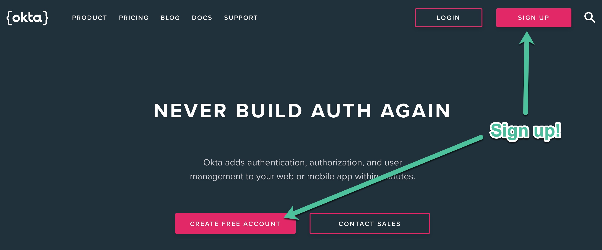
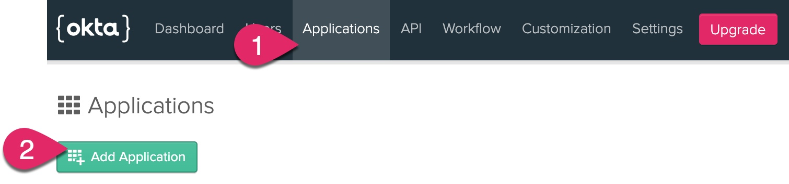
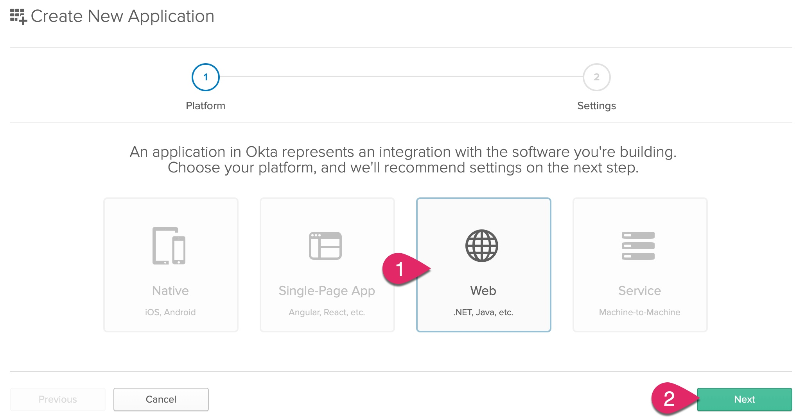
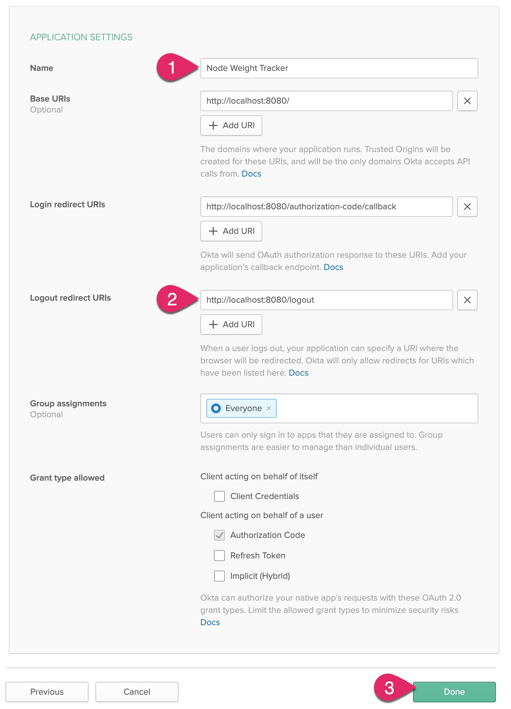
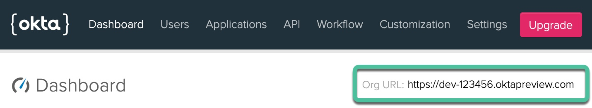
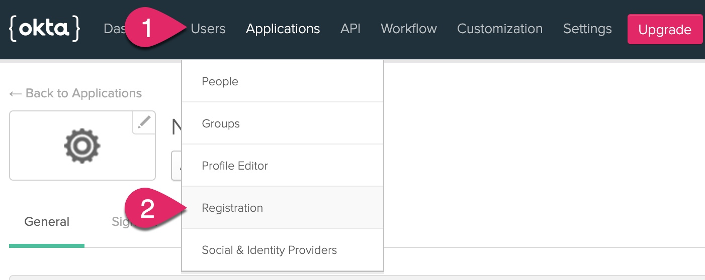
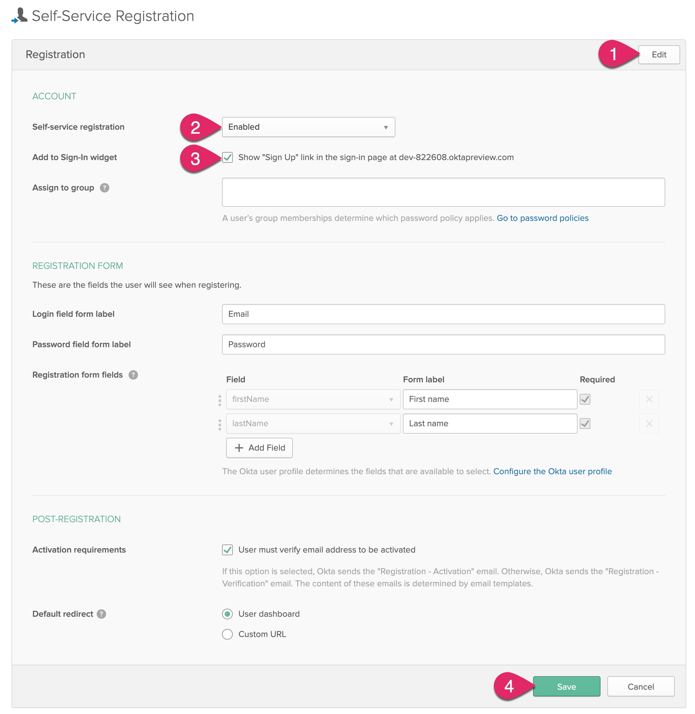

# Build a Weight Tracker App with Node.js and PostgreSQL

Did you make any resolutions this year? One resolution I seem to make *every* year is to lose weight and exercise. Sometimes I stick to it.

A good way I have found to keep on track with any resolution is to record progress. There's something about visualizing progress that helps me stay motivated.

In this tutorial, you are going to create a modern Node.js application to keep track weight measurements. The technologies you're going to use include PostgreSQL, a new and exciting Postgres client for Node.js, hapi, Vue.js, and Okta to provide account registration and login, and to secure the API!

Before we begin, let's first check some requirements.

* [Node.js](https://nodejs.org/) 12.x or higher
* [PostgreSQL](https://www.postgresql.org/): This can be installed locally using Docker. More details on this later in the tutorial!
* [Free Okta developer account](https://developer.okta.com/): For account registration, login, and security

## Create Your Node.js Project

Open up your terminal or command prompt. Change to the folder where you store projects, and create a new folder for this project.

```sh
mkdir node-weight-tracker
cd node-weight-tracker
```

Next, use `npm` to initialize the project's `package.json` file.

```sh
npm init -y
```

In this tutorial, we are using [hapi](https://hapi.dev), a wonderful application framework that supports all the latest features of Node.js and the JavaScript language. Here is an overview of the modules you will use in this project.

|Module|Description|
|:---|:---|
|hapi|Web application framework for Node.js|
|bell|Hapi plugin to support third-party logins|
|boom|Hapi plugin for HTTP errors|
|cookie|Hapi plugin for cookie-based authentication|
|inert|Hapi plugin for serving static files|
|joi|Hapi plugin for validating request and response data|
|vision|Hapi plugin for rendering server-side templates|
|dotenv|A module to manage configuration using environment variables|
|ejs|A template engine that uses JavaScript|
|postgres|A PostgreSQL client|
|nodemon|Monitors file changes and automatically restarts the server (for development only and not to be used in production)|

Install all the project dependencies using the following `npm` commands. It's important to note these commands install specific versions available at the time of this writing.

```sh
npm install @hapi/hapi@19 @hapi/bell@12 @hapi/boom@9 @hapi/cookie@11 @hapi/inert@6 @hapi/joi@17 @hapi/vision@6 dotenv@8 ejs@3 postgres@1

npm install --save-dev nodemon@2
```

Now open the project in your editor of choice.

> If you don't already have a favorite code editor, I recommend installing [Visual Studio Code](https://code.visualstudio.com/). VS Code has exceptional support for JavaScript and Node.js, such as smart code completion and debugging. There's also a vast library of free extensions contributed by the community.

Create a new file named `.env` in the root of the project and add the following configuration.

```sh
# Host configuration
PORT=8080
HOST=localhost
```

Next, create a folder in the project named `src`. In the `src` folder, create folders named `assets`, `plugins`, `routes`, and `templates`. We will use each of these folders in the future to organize code. Your project should currently look something like the following.

```sh
> node_modules
> src
   > assets
   > plugins
   > routes
   > templates
.env
package-lock.json
package.json
```

### Create a "hello world" web app using hapi

In the `src` folder, create a new file named `index.js`. Add the following code to this file.

```js
"use strict";

const dotenv = require( "dotenv" );
const Hapi = require( "@hapi/hapi" );

const routes = require( "./routes" );

const createServer = async () => {
  const server = Hapi.server( {
    port: process.env.PORT || 8080,
    host: process.env.HOST || "localhost"
  } );

  server.route( routes );

  return server;
};

const init = async () => {
  dotenv.config();
  const server = await createServer();
  await server.start();
  console.log( "Server running on %s", server.info.uri );
};

process.on( "unhandledRejection", ( err ) => {
  console.log( err );
  process.exit( 1 );
} );

init();
```

In the previous code, the `init()` function uses `dotenv` to read in the `.env` configuration file, creates the web server, starts the server, and outputs the address of the web server. The `createServer()` function creates an instance of the hapi server based on the `port` and `host` values in the `.env` configuration file. It then registers the routes defined in the `routes` module. There's also an event handler defined for `unhandledRejection` in case an exception occurs anywhere in the application that doesn't have error handling, which outputs the error and shuts down the server.

Next you need to define at least one route for the `routes` module. Create a new file in the `src/routes` folder named `index.js`. Add the following code to this file.

```js
"use strict";

const home = {
  method: "GET",
  path: "/",
  handler: ( request, h ) => {
    return "hello world!";
  }
};

module.exports = [ home ];
```

The previous code defines one route, `home`, which returns the text "hello world!" The module is designed to export an array, as you will be adding more routes to this module later.

Open the `package.json` file and find the `scripts` section. Add the following script to this section.

```js
    "dev": "nodemon --watch src -e ejs,js src/index.js",
```

Now, go to the command line and type the following command to start the development web server.

```sh
npm run dev
```

Open your browser and navigate to `http://localhost:8080`. You should see your "hello world!" message.

Go back to the `src/routes/index.js` file and make a change to the "hello world!" message and save the file. You should see `nodemon` automatically detect the change and restart the server. Refresh the browser and you should see that change reflected. You are on your way to developing a _happy_ little web application!

## Create a PostgreSQL Server with Docker

> Note: If you already have an instance of PostgreSQL you can work with, great! You can skip ahead to the next section.

We are going to use PostgreSQL to store weight measurements. However, installing server software like PostgreSQL on a development machine is no trivial task. That's where Docker comes in! If you don't already have Docker installed, follow the [install guide](https://docs.docker.com/install/#supported-platforms) and then come back.

With Docker installed, run the following command to download the latest PostgreSQL container.

```sh
docker pull postgres:latest
```

Next, create an instance of a PostgreSQL database server. Feel free to change the administrator password value.

```sh
docker run -d --name measurements -p 5432:5432 -e 'POSTGRES_PASSWORD=p@ssw0rd42' postgres
```

Here is a quick explanation of the previous Docker parameters.

|Parameter|Description|
|:---|:---|
|-d|This launches the container in daemon mode, so it runs in the background.|
|--name|This gives your Docker container a friendly name|
|-p|This maps a TCP port on the host (your computer) to a port in the container. By default, PostgreSQL uses port 5432 for connections.|
|-e|This sets an environment variable in the container.|
|postgres|This final parameter tells Docker to use the postgres image.|

> Note: If you restart your computer, may need to restart the Docker container. You can do that from the command line using the following command: `docker start measurements`.

## Add PostgreSQL Configuration

Add the following settings to the end of the `.env` file.

```sh
# Postgres configuration
PGHOST=localhost
PGUSERNAME=postgres
PGDATABASE=postgres
PGPASSWORD=p@ssw0rd42
PGPORT=5432
```

Note: If you changed the database administrator password, or you have different credentials for an existing server, be sure to update the values to match your specific environment.

## Add a PostgreSQL Database Build Script

In order to use a database, you need a way to initialize it with any tables and other schema, initial data, and so forth. One way to do that is to create a script. Here you'll use Node.js to execute a build script that will create the schema needed for the application.

Next, create a folder in the root of the project named `tools`. In this folder, create a new file named `initdb.js` and add the following code.

```js
"use strict";

const dotenv = require( "dotenv" );
const postgres = require( "postgres" );

const init = async () => {
  // read environment variables
  dotenv.config();
  
  try {
    // connect to the local database server
    const sql = postgres();

    console.log( "dropping table, if exists..." );
    await sql`DROP TABLE IF EXISTS measurements`;

    console.log( "creating table..." );
    await sql`CREATE TABLE IF NOT EXISTS measurements (
      id INT NOT NULL PRIMARY KEY GENERATED ALWAYS AS IDENTITY
      , user_id varchar(50) NOT NULL
      , measure_date date NOT NULL
      , weight numeric(5,1) NOT NULL
    )`;

    await sql.end();
  } catch ( err ) {
    console.log( err );
    throw err;
  }
};

init().then( () => {
  console.log( "finished" );
} ).catch( () => {
  console.log( "finished with errors" );
} );
```

Next, update the `scripts` section in the `package.json` file to include the following command.

```js
    "initdb": "node tools/initdb.js",
```

Now, you can run the build script at the command line with the following command.

```sh
npm run initdb
```

You should see the message `finished` at the console. A new table named `measurements` is now in your database! Any time you want to reset your database, just rerun the script.

## Easily Add Authentication to Node and hapi

When building an application like this weight tracker, you probably want your data kept private and safe. It would be nice to share this application with others so they can take advantage of it, too. However, to create your own user registration and login (authentication) is no trivial task. There are registration, login, and password reset forms, email verification steps, encrypting passwords, and the list goes on and on. Oh, and how about keeping up with all the latest attacks and keeping your data secure? Yikes!

The good news is Okta makes all of this a breeze! To begin, go to [developer.okta.com](https://developer.okta.com) and create a free developer account.



After you create your account, click the **Applications** link at the top, and then click **Add Application**.



Next, choose to create a **Web Application** and click **Next**.



Enter a name for your application, such as *Node Weight Tracker*. Update the **Logout redirect URIs** to `http://localhost:8080/logout`. Then, click Done to finish creating the application.



Copy the following configuration to your `.env` file.

```sh
HOST_URL=http://localhost:8080
COOKIE_ENCRYPT_PWD=superAwesomePasswordStringThatIsAtLeast32CharactersLong!
NODE_ENV=development

# Okta configuration
OKTA_ORG_URL=https://{yourOktaOrgUrl}
OKTA_CLIENT_ID={yourClientId}
OKTA_CLIENT_SECRET={yourClientSecret}
```

In the Okta application console, click on your new application's **General** tab, and find near the bottom of the page a section titled "Client Credentials." Copy the `Client ID` and `Client secret` values and paste them into your `.env` file to replace `{yourClientId}` and `{yourClientSecret}`, respectively.


Click on the **Dashboard** link at the top. Find your **Org URL** to the right of the page. Copy this URL and paste it into your `.env` file to replace `{yourOrgUrl}`.



### Enable self-service registration

To allow other people to sign up for an account in your application, you need to enable the *self-service registration* feature. Click on the **Users** menu and select **Registration**.



Next, click the **Edit** button. Change **Self-service registration** to *Enabled*. Make sure the **Show "Sign Up" link"** is checked. Click the **Save** button at the bottom of the form.



## Secure Your Node.js Application

Now that you have an Okta account and application, it's time to configure the hapi application to verify users are logged in any time a protected resource is requested. If not, the application will prompt them to login using Okta.

Under `src/plugins`, create a new file named `auth.js`. Copy the following code into this file.

```js
"use strict";

const bell = require( "@hapi/bell" );
const cookie = require( "@hapi/cookie" );

const isSecure = process.env.NODE_ENV === "production";

module.exports = {
  name: "auth",
  version: "1.0.0",
  register: async server => {

    await server.register( [ cookie, bell ] );

    // configure cookie authorization strategy
    server.auth.strategy( "session", "cookie", {
      cookie: {
        name: "okta-oauth",
        path: "/",
        password: process.env.COOKIE_ENCRYPT_PWD,
        isSecure // Should be set to true (which is the default) in production
      },
      redirectTo: "/authorization-code/callback", // If there is no session, redirect here
    } );

    // configure okta oauth strategy
    server.auth.strategy( "okta", "bell", {
      provider: "okta",
      config: { uri: process.env.OKTA_ORG_URL },
      password: process.env.COOKIE_ENCRYPT_PWD,
      isSecure,
      location: process.env.HOST_URL,
      clientId: process.env.OKTA_CLIENT_ID,
      clientSecret: process.env.OKTA_CLIENT_SECRET
    } );

    // set the default authorization strategy for all routes
    server.auth.default( "session" );

    // Hook into onPreResponse event to add authentication info to every view
    server.ext( "onPreResponse", ( request, h ) => {
      if ( request.response.variety === "view" ) {
        const auth = request.auth.isAuthenticated ? {
          isAuthenticated: true,
          isAnonymous: false,
          email: request.auth.artifacts.profile.email,
          firstName: request.auth.artifacts.profile.firstName,
          lastName: request.auth.artifacts.profile.lastName
        } : {
          isAuthenticated: false,
          isAnonymous: true,
          email: "",
          firstName: "",
          lastName: ""
        };
        request.response.source.context.auth = auth;
      }
      return h.continue;
    } );
  }
};
```

Now add a new file to `src/plugins` named `index.js` and paste the following code.

```js
"use strict";

const Inert = require( "@hapi/inert" );
const Vision = require( "@hapi/vision" );
const ejs = require( "ejs" );

const auth = require( "./auth" );

module.exports = {
  register: async server => {
    await server.register( [ Inert, Vision, auth ] );

    // configure view templates
    server.views( {
      engines: { ejs },
      relativeTo: __dirname,
      path: "../templates",
      layout: true
    } );
  }
};
```

In addition to registering the new `auth` plugin, this code also configures the `ejs`, `inert`, and `vision` plugins that will be used to render HTML content. Let's set up a few EJS templates to render.

In the `src/templates` folder, create a new file named `layout.ejs`. This is main template that all views will use. Paste the following markup into `layout.ejs`.

```html
<!DOCTYPE html>
<html>

<head>
  <meta charset="utf-8">
  <meta name="viewport" content="width=device-width, initial-scale=1">
  <title><%= title %></title>
  <link rel="stylesheet" href="https://cdn.jsdelivr.net/npm/bulma@0.8.0/css/bulma.min.css">
  <link rel="stylesheet" href="/assets/css/site.css">
  <script src="https://cdn.jsdelivr.net/npm/vue@2.6.11"></script>
  <script defer src="https://use.fontawesome.com/releases/v5.3.1/js/all.js"></script>
  <script src="/assets/js/site.js"></script>
</head>

<body>
  <%- include( "includes/navigation" ); %>
  <section class="section">
    <div class="container">
      <%- content %>
    </div>
  </section>
</body>

</html>
```

You might notice there's an `include` in this template for navigation. The next step is to create a navigation template that will rendered for every page. In the `src/templates` folder, create a new folder named `includes`. In the `includes` folder, create a file named `navigation.ejs` and paste in the following markup.

```html
<nav class="navbar" role="navigation" aria-label="main navigation">
  <div class="navbar-brand">
    <a class="navbar-item navbar-logo" href="/">
      Weight Tracker
    </a>

    <a role="button" class="navbar-burger burger" aria-label="menu" aria-expanded="false"
      data-target="navbarBasicExample">
      <span aria-hidden="true"></span>
      <span aria-hidden="true"></span>
      <span aria-hidden="true"></span>
    </a>
  </div>

  <div id="navbarBasicExample" class="navbar-menu">
    <div class="navbar-start">
      <a class="navbar-item" href="/">
        Home
      </a>

      <a class="navbar-item" href="/list">
        Progress
      </a>
      <a class="navbar-item" href="/add">
        Add Measurement
      </a>

    </div>
  </div>

  <div class="navbar-end">
    <% if ( auth.isAuthenticated ) { %>
      <div class="navbar-item">Welcome, <%= auth.firstName %>!</div>
    <% } %>
    <div class="navbar-item">
      <div class="buttons">
        <% if (!auth.isAuthenticated) { %>
        <a href="/login" class="button is-primary">
          <strong>Log in</strong>
        </a>
        <% } else { %>
        <a href="/logout" class="button is-light">
          <strong>Log Out</strong>
        </a>
        <% } %>
      </div>
    </div>
  </div>
  </div>
</nav>
```

As you can see, there are some conditional statements in the template based on whether or not the current user is authenticated. If the user is not authenticated, a **Login** button is displayed. If a user is currently logged in, a welcome message and a **Logout** button are displayed.

Next you will add an EJS template for the home page. In the `templates` folder, create a new file named `index.ejs` and paste in the following markup.

```html
<h1 class="title">Node.js Weight Tracker</h1>

<p>Welcome to the <b>Node.js Weight Tracker</b> sample project!</p>

<% if ( auth.isAnonymous ) { %>
  <p><a href="/login">Click here</a> to login or create an account.</p>
<% } %>

<% if ( auth.isAuthenticated ) { %>
  <p><a href="/add">Add</a> a weight measurement or <a href="/list">view</a> your progress.</p>
<% } %>
```

While you're adding templates, go ahead an add a template for a custom 404 (Not Found) response. Create a `404.ejs` file in the `templates` folder and paste in the following markup.

```html
<h1 class="title">Oh no!</h1>

<p>That page was not found!</p>
```

Now you need to update the routes to return home page view, and configure which routes require authentication. In the `src/routes` folder, create a new file named `auth.js` and paste the following code.

```js
"use strict";

const boom = require( "@hapi/boom" );

const login = {
  method: "GET",
  path: "/login",
  options: {
    handler: request => {
      if ( !request.auth.isAuthenticated ) {
        return `Authentication failed due to: ${ request.auth.error.message }`;
      }
    }
  }
};

const oAuthCallback = {
  method: "GET",
  path: "/authorization-code/callback",
  handler: ( request, h ) => {
    if ( !request.auth.isAuthenticated ) {
      throw boom.unauthorized( `Authentication failed: ${ request.auth.error.message }` );
    }
    // save the credentials to the session cookie
    request.cookieAuth.set( request.auth.credentials );
    return h.redirect( "/" );
  },
  options: {
    auth: "okta"
  }
};

const logout = {
  method: "GET",
  path: "/logout",
  handler: ( request, h ) => {
    try {
      if ( request.auth.isAuthenticated ) {
        // clear the local session
        request.cookieAuth.clear();
      }

      return h.redirect( "/" );
    } catch ( err ) {
      request.log( [ "error", "logout" ], err );
    }
  },
  options: {
    auth: {
      mode: "try"
    }
  }
};

module.exports = [
  login,
  oAuthCallback,
  logout
];
```

The previous code defines three new routes. The `/login` route by default requires authentication because it was defined in the `src/plugins/auth.js` module with the statement `server.auth.default( "session" );`. Any request to `/login` while the user is not logged in will result in being redirected to the `/authorization-code/callback` route.

The `/authorization-code/callback` route is configured to use the _"okta"_ authentication strategy. Any request to this route while the user is not logged in will result in being redirected to the Okta login (which includes a link to sign up for an account). After successfully logging into Okta, the user will be redirected _back_ to this route. The user's credentials are saved in the session cookie and the user is redirected back to the home page.

The `/logout` route clears the session cookie and redirects the user back to the home page.

Next, update `src/routes/index.js` with the following code.

```js
"use strict";

const path = require( "path" );

const auth = require( "./auth" );

const home = {
  method: "GET",
  path: "/",
  options: {
    auth: {
      mode: "try"
    },
    handler: ( request, h ) => {
      return h.view( "index", { title: "Home" } );
    }
  }
};

const staticAssets = {
  method: "GET",
  path: "/assets/{param*}",
  handler: {
    directory:{ 
      path: path.join( __dirname, "..", "assets" )
    }
  },
  options: { auth: false }
};

const error404 = {
  method: "*",
  path: "/{any*}",
  handler: function ( request, h ) {
    return h.view( "404", { title: "Not Found" } ).code( 404 );
  },
  options: { auth: false }
};

module.exports = [
  home,
  staticAssets,
  error404
].concat( auth );
```

The previous code updates the home page route with an auth mode `try`. The `try` mode checks to see if the user is authenticated, but doesn't require authentication. The code also imports the authentication routes, and sets up routes for static assets and the custom 404 page.

Speaking of static assets, add a new folder to `src/assets` named `css`. In the `css` folder, create a new file named `site.css` and paste the following code.

```css
.navbar-logo {
  font-weight: bold;
  font-size: 1.2em;
}
```

Add a new folder to `src/assets` named `js`. In the `js` folder, create a new file named `site.js` and paste the following code.

```js
"use strict";

document.addEventListener( "DOMContentLoaded", () => {

  // Get all "navbar-burger" elements
  const $navbarBurgers = Array.prototype.slice.call( document.querySelectorAll( ".navbar-burger" ), 0 );

  // Check if there are any navbar burgers
  if ( $navbarBurgers.length > 0 ) {

    // Add a click event on each of them
    $navbarBurgers.forEach( el => {
      el.addEventListener( "click", () => {

        // Get the target from the "data-target" attribute
        const target = el.dataset.target;
        const $target = document.getElementById( target );

        // Toggle the "is-active" class on both the "navbar-burger" and the "navbar-menu"
        el.classList.toggle( "is-active" );
        $target.classList.toggle( "is-active" );

      } );
    } );
  }
} );
```

This client-side JavaScript is to enable a better navigation experience for mobile and tablet browsers.

> Note: When deploying the application to a production environment, you must create a new `.env` file or use real environment variables to configure the application. Values such as the PostgreSQL connection information, `HOST_URL`, `COOKIE_ENCRYPT_PWD`, and `NODE_ENV` configuration _must_ be updated to reflect the new environment.
